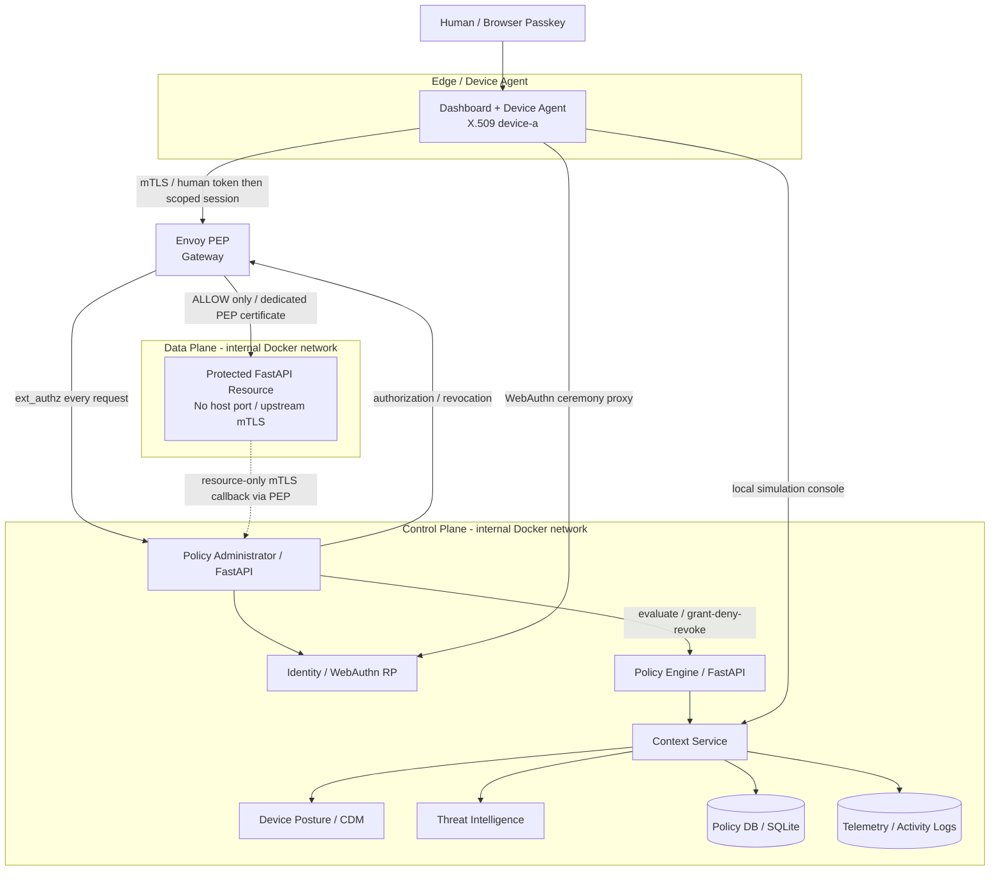
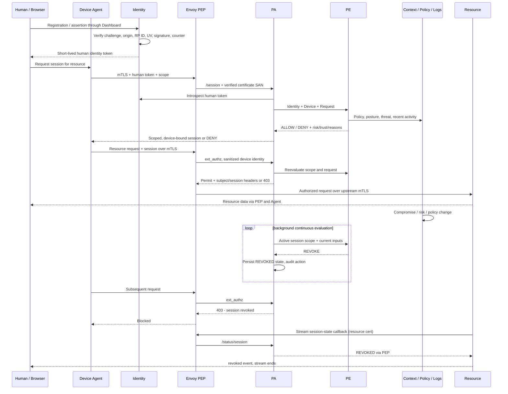

# 架構與流程（SP 800-207）

Envoy 同時連接 edge/control/data；它是受信任的 gateway，不是 sidecar。PE/PA 是分開的 process 與 service；PDP 是兩者的邏輯組合。Diagram 中 CDM/TI/Policy DB/Logs 是 Context service 的邏輯模組，沒有假稱為獨立產品。

## 與 NIST 對齊

| SP 800-207 概念 | 本 Demo |
|---|---|
| §3.1 PE 最終 grant/deny/revoke decision | `app/pe.py` + `app/trust.py` |
| §3.1 PA 建立/停止路徑，執行 PE 決策 | `app/pa.py` scoped session lifecycle + Envoy ext_authz |
| §3.1 PEP 建立、監控、終止存取 | Device agent + Envoy gateway；逐請求 gate 與 stream cooperative termination |
| §3.2.1 Device Agent/Gateway | Agent 持 device private key，Gateway 在 Resource 前 |
| Control/Data plane | separate internal Docker networks，只有 PEP 跨接 |
| §3.3 Trust algorithm | necessary conditions + score，讀取 identity/device/policy/threat/history |
| Dynamic policy / continuous evaluation | 每請求 + periodic session evaluation；新訊號與政策即時影響決策 |
| Least privilege | exact method/path grants + session scope |

必要條件：human token 有效、device managed 且未 compromised、scope 在 grants 中。Risk weights：OS outdated 30、high-risk IP 70、abnormal 60，累計上限 100；trust=100-risk，預設門檻60。Compromised 是 hard gate，可能 trust=100 仍 REVOKE，因 score 不能蓋過必要條件。數值是展示用策略，不是 NIST 規定。

Source: [NIST SP 800-207](https://nvlpubs.nist.gov/nistpubs/SpecialPublications/NIST.SP.800-207.pdf), [Envoy ext_authz](https://www.envoyproxy.io/docs/envoy/v1.33.2/configuration/http/http_filters/ext_authz_filter), [py_webauthn](https://duo-labs.github.io/py_webauthn/).
